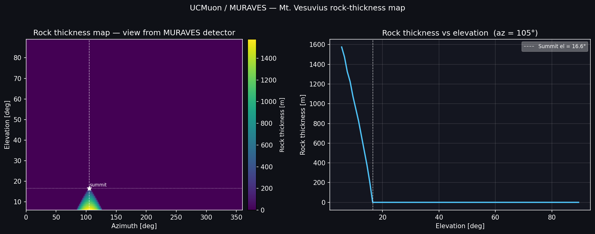
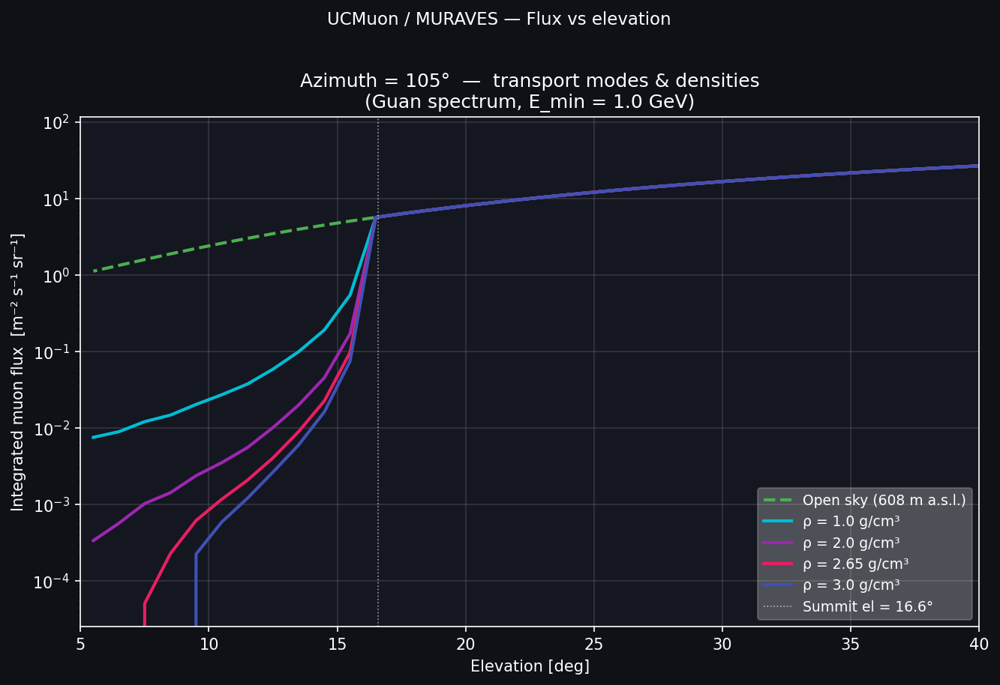
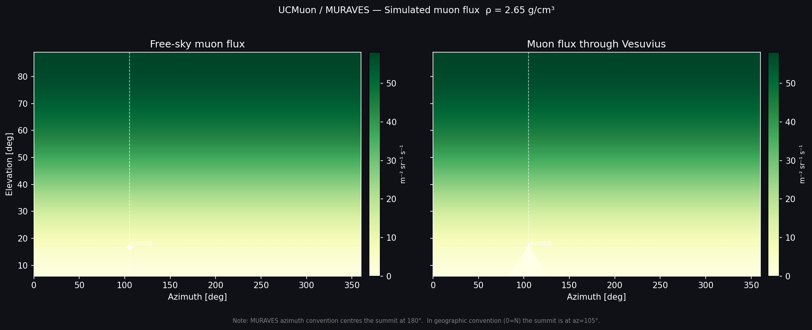
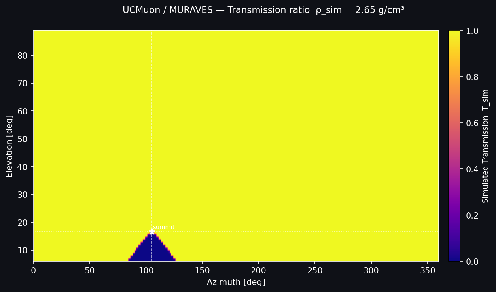

# Mt. Vesuvius — UCMuon/MURAVES Example

Standalone example reproducing the MURAVES muography simulation pipeline
(Rajan et al., Muographers 2026, Budapest) using UCMuon's backward-MC physics
and terrain engine. No GUI needed. Runs in **~3 seconds** at full resolution
and outputs four publication-style figures directly into `examples/vesuvius/figs/`.

**References**
- Hong et al. (2025) *J. Appl. Phys.* **138**, [doi:10.1063/5.0275078](https://doi.org/10.1063/5.0275078) — MURAVES project updates at Mt. Vesuvius
- Rajan et al. (2026) MURAVES/Muographers26 presentation

---

## Files in this folder

```
examples/vesuvius/
├── ucmuon_vesuvius_muraves.py   ← main simulation script
├── MURAVES_GUIDE.md             ← this file
└── figs/                        ← output figures (auto-created on first run)
    ├── fig_vesuvius_thickness.png
    ├── fig_vesuvius_flux_elevation.png
    ├── fig_vesuvius_flux_maps.png
    └── fig_vesuvius_transmission.png
```

---

## What this example does

`ucmuon_vesuvius_muraves.py` runs the full UCMuon physics pipeline for
Mt. Vesuvius in a single script:

1. **Builds an overburden map** — ray-traces each (azimuth, elevation) direction
   from the MURAVES detector through a truncated-cone Vesuvius model (or a real
   DEM if supplied) to get rock thickness in g/cm².
2. **Computes the open-sky flux** — backward-MC integral over the Guan 2015
   spectrum, E = 1–2500 GeV, once per zenith angle.
3. **Computes the through-rock flux map** — backward-MC at each direction using
   the ray-traced path length.
4. **Computes the transmission map** — `T_sim = Φ_rock / Φ_sky` per direction.
5. **Generates four figures**: thickness map, flux vs elevation, flux maps, transmission ratio.

**Geometry** (MURAVES / Hong et al. 2025):

| | Value |
|---|---|
| Detector (SW flank, Osservatorio Vesuviano) | 40.8271°N, 14.4006°E, 608 m a.s.l. |
| Summit (Gran Cono) | 40.8218°N, 14.4265°E, 1281 m a.s.l. |
| Summit direction from detector | az = 105.1°, el = 16.6° above horizon |
| Cone model | truncated frustum, apex at summit, base radius 1900 m at 150 m a.s.l. |

**Spectrum**: Guan et al. 2015 (mode 4), E_min = 1 GeV — required for the
low-elevation signal zone (el < 25°) where muons penetrate 100–1600 m of rock.

---

## Requirements

All standard packages — no extra install needed:

```bash
pip install numpy matplotlib scipy   # already in requirements.txt
```

Only needed for real DEM mode:
```bash
pip install rasterio
```

---

## Quick start

Run from the **UCMuon project root** (not from inside `examples/vesuvius/`):

```bash
cd /path/to/UCMuon
python examples/vesuvius/ucmuon_vesuvius_muraves.py
```

**Runtime: ~3 seconds** at full resolution (360 × 85 = 30 600 directions).  
Figures are saved to `examples/vesuvius/figs/` automatically.

---

## Command-line options

```
positional argument:
  [dem_file]        Path to DEM file (.tif / .xyz / .asc)
                    Omit to use the built-in synthetic cone model (default)

optional arguments:
  --rho   FLOAT     Bulk rock density [g/cm³]   default: 2.65
  --n-az  INT       Number of azimuth bins       default: 360  (1° per bin)
  --n-ze  INT       Number of zenith bins        default: 85   (1° per bin)
  --step  FLOAT     Ray-trace step size [m]      default: 25
  --out-dir PATH    Directory for output figures default: examples/vesuvius/figs
```

Examples:

```bash
# Full resolution with real DEM
python examples/vesuvius/ucmuon_vesuvius_muraves.py vesuvius_dem.tif

# Different density
python examples/vesuvius/ucmuon_vesuvius_muraves.py --rho 1.7

# Custom output directory
python examples/vesuvius/ucmuon_vesuvius_muraves.py --out-dir /tmp/myfigs

# Quick test at coarse resolution (~0.1 s)
python examples/vesuvius/ucmuon_vesuvius_muraves.py --n-az 72 --n-ze 30
```

---

## Output figures

### Fig 1 — Rock thickness map (`fig_vesuvius_thickness.png`)



**Left panel:** 2D map of rock thickness [m] as a function of azimuth and elevation.
The Vesuvius cone appears as a compact triangular structure centred at
az ≈ 105°, el ≈ 10–18° (white star = summit). Maximum thickness ≈ 1600 m at
the lowest elevations looking into the base of the cone. All other directions
see open sky (black = 0 m) — the Vesuvius cone subtends only ~40° × 12° of solid
angle from the detector.

**Right panel:** Slice through the summit azimuth (az = 105°). Rock thickness
drops sharply from ~1600 m at el = 5° to zero at el ≈ 18° — the upper edge of
the cone. Above that elevation the ray exits the cone entirely.

---

### Fig 2 — Flux vs elevation (`fig_vesuvius_flux_elevation.png`)



Integrated muon flux vs elevation angle at the summit azimuth (105°) for four
rock densities plus open sky.

- **Green dashed** (open sky): the Guan 2015 integral above 1 GeV, rising from
  1.1 m⁻² s⁻¹ sr⁻¹ at el = 5.5° to 5.6 at the summit elevation and 27 at
  el = 40°, roughly as cos²θ. At the zenith it is 58 (Guan's exact integral is
  60, the 50-point energy grid is 4 % low and cancels in T_sim); PDG quotes
  ≈ 70, with recent measurements 10–15 % lower.
- **Coloured curves** (ρ = 1.0, 2.0, 2.65, 3.0 g/cm³): one elevation bin below
  the summit (el = 15.5°) the flux has already dropped 10–75×, to 0.54
  (ρ = 1.0) and 0.097 (ρ = 2.65) m⁻² s⁻¹ sr⁻¹.
- **Density separation**: the curves stay apart all the way down the cone. At
  el = 10.5° they are 2.7 × 10⁻², 3.5 × 10⁻³, 1.2 × 10⁻³ and 5.8 × 10⁻⁴ for
  ρ = 1.0, 2.0, 2.65, 3.0: this is the density-sensitive zone used for
  inversion.
- **Near the cone base** the flux vanishes for the denser rock: below
  el ≈ 7° at ρ = 2.65 and el ≈ 9° at ρ = 3.0. That is where the opacity passes
  3616 m w.e., the end of the backward MC's range table (2 TeV); the true flux
  there is not zero but is below 10⁻⁵ of the open sky. The same limit makes the
  flux a lower bound under thick rock short of that: about 6 % low at
  2000 m w.e. and 37 % at 3000 m w.e. The script prints a warning for it.
- **Above el ≈ 17°**: all curves rejoin the open-sky reference — the ray has
  exited the cone completely.

The sharp upper edge is characteristic of the compact cone geometry. A real
DEM would show a broader, more gradual transition.

Up to v1.1.2 this figure showed the open sky flat at ~10⁻³ and the rock curves
dropping to ~10⁻⁸: the script summed the spectrum over a log-energy grid
without the factor E, and computed the rock flux as a rate over a whole cone of
directions at half the zenith angle. Both now use the backward MC's
`directional_flux`, as the terrain engine does.

---

### Fig 3 — Free-sky vs through-rock flux maps (`fig_vesuvius_flux_maps.png`)



**Left** (free-sky flux): smooth, azimuth-independent gradient — flux decreases
only with increasing zenith angle (lower elevation = higher zenith = lower flux),
from 58 m⁻² s⁻¹ sr⁻¹ at the zenith to about 1 near the horizon. On this linear
scale the whole band below el ≈ 20° is pale, so the cone shadow on the right is
faint; Fig 4 shows it clearly.

**Right** (through-rock flux, ρ = 2.65 g/cm³): identical to the left panel
everywhere except at the cone location (az ≈ 90–130°, el ≈ 8–18°) where the
flux collapses to near zero (white/yellow region = T_sim ≈ 0). The cone shadow
is the small bright triangular feature; bright here means near-zero flux because
the YlGn colormap runs white (low) → green (high).

> **Azimuth convention:** this script uses geographic convention (0 = North,
> 90 = East). MURAVES figures use a detector-centric convention where the
> summit is placed at az = 180°. Summit is at **az = 105°** here.
> To match MURAVES figures directly, rotate by 75° (180° − 105°).

---

### Fig 4 — Transmission ratio (`fig_vesuvius_transmission.png`)



`T_sim = Φ_rock / Φ_sky` per (az, el) pixel. Yellow = T_sim ≈ 1 (open sky,
~99% of the sky). Dark blue/purple = T_sim ≈ 0 (cone shadow). The cone
footprint is clearly triangular at az ≈ 88–128°, el ≈ 7–18°, with the apex
at the summit (white star).

Inside the cone at ρ = 2.65 g/cm³ the median transmission is 7 × 10⁻⁴: 57 % of
the blocked directions are below 0.001, and the rim reaches 0.16.
This map is the forward model input for density inversion: running at multiple
densities and comparing against measured T_data reveals the internal density
structure of the volcano.

---

## Part 2 — Density analysis (T_sim library + inversion)

To invert for density you need one `terrain_transmission.dat` file per bulk
density. A library for the MURAVES detector ships in `tsim_library/`
(ρ = 1.5, 2.0, 2.5, 2.65, 3.0 g/cm³; Guan 2015, 1–2500 GeV, real DEM), written
by `make_tsim_library.py` from the bundled `vesuvius_dem.tif`. Its deepest
directions are lower bounds: at ρ = 2.65, 721 of the 966 directions through
rock need surface energies beyond the backward MC's range table (2 TeV) for
more than 1 % of their flux, and 387 read exactly 0. None of the pixels the
inversion below uses is cut by more than 1 %.

To write your own with the terrain driver CLI (stdin, one value per line: DEM,
latitude, longitude, altitude, density, spectrum, n_az, n_ze, ze_max, step,
transport mode, then the overburden, flux, summary and transmission paths):

```bash
mkdir -p output/vesuvius_tsim

for rho in 1.5 2.0 2.65 3.0; do
    python gui/ucmuon_terrain_driver.py <<EOF
examples/vesuvius/vesuvius_dem.tif
40.8271
14.4006
608.0
${rho}
3
360
85
85.0
25.0
1
output/vesuvius_tsim/overburden_${rho}.dat
output/vesuvius_tsim/flux_${rho}.dat
output/vesuvius_tsim/summary_${rho}.dat
output/vesuvius_tsim/tsim_${rho}.dat
EOF
    echo "Done: rho=${rho}"
done
```

Spectrum 3 is Guan 2015. The CLI integrates the spectrum over 1–5000 GeV (1 GeV
is the lower end of Guan's fit); `make_tsim_library.py` uses 1–2500 GeV, which
gives the same T_sim within 1 %. Each run ray-traces the DEM, which
takes minutes at this resolution.

### Inversion — GUI

1. `streamlit run gui/ucmuon_gui.py`
2. Open **🔬 Density** tab
3. Paste the four file paths into the T_sim Library box:
   ```
   examples/vesuvius/tsim_library/terrain_transmission_1.50.dat
   examples/vesuvius/tsim_library/terrain_transmission_2.00.dat
   examples/vesuvius/tsim_library/terrain_transmission_2.65.dat
   examples/vesuvius/tsim_library/terrain_transmission_3.00.dat
   ```
4. Click **Load Library**
5. Section 2 → **Generate synthetic**: True density = `2.0`, N events = `100000`
6. Section 3 → reference density = `2.65` → **▶ Run Inversion**

### Inversion — Python

```python
import sys; sys.path.insert(0, "gui")
from ucmuon_density_analysis import (
    load_transmission_map, build_tsim_library,
    invert_density_map, compute_double_ratio,
    generate_synthetic_tdata, write_density_map,
)

L = "examples/vesuvius/tsim_library/terrain_transmission"
tsim_lib = build_tsim_library([f"{L}_{r}.dat" for r in ("1.50", "2.00", "2.65", "3.00")])

# Synthetic test: true density = 2.0 g/cm³, 100k events
T_data, sigma_T = generate_synthetic_tdata(tsim_lib, true_rho=2.0, n_events=100_000)

rho_map, sigma_rho, status = invert_density_map(T_data, tsim_lib, sigma_T)
D_map = compute_double_ratio(T_data, tsim_lib[2.65])

az_c, el_c, _, meta = load_transmission_map(f"{L}_2.65.dat")
write_density_map(az_c, el_c, rho_map, sigma_rho, status,
                  "output/vesuvius_density.dat", meta)
```

### Expected inversion results

| Region | Status | Why |
|---|---|---|
| Most directions (el > 20°, no cone) | 1 — open sky | T_sim ≈ 1 for all densities |
| Deep inside the mountain (585 pixels, el 5.5–14.5°, median 8.5°) | 4 — low sensitivity | too few muons for 10⁵ events |
| Thinner rock (381 pixels, el 5.5–16.5°, median 10.5°) | 0 — OK | Density-sensitive zone; T_sim varies with ρ |

For the synthetic test with the shipped library (ρ_true = 2.0, N = 10⁵; the
synthetic data are seeded, so these numbers reproduce exactly):
- Recovered density in the 381 OK pixels: **ρ̂ = 2.007 g/cm³**, pixel-to-pixel
  scatter 0.027 g/cm³
- Double ratio D = 1.81 (median; D > 1 since ρ_true < ρ_ref = 2.65)

Up to v1.1.2 the shipped library gave no OK pixels in this test: its open-sky
reference integrated CosmoALEPH, a fit above ~100 GeV/c, from 0.5 GeV, which
put every T_sim 10²–10⁴ too low (`docs/FLUX_NORMALISATION_AUDIT.md`).

---

## Getting a real DEM

**A DEM is already bundled**: `vesuvius_dem.tif` in this directory (SRTM GL1
30 m, W=14.35, S=40.76, E=14.52, N=40.90; public domain, see
[`DEM_SOURCE.md`](DEM_SOURCE.md)). The GUI Terrain tab loads it by default,
and the script accepts it directly:

```bash
python examples/vesuvius/ucmuon_vesuvius_muraves.py examples/vesuvius/vesuvius_dem.tif
```

To re-download it or fetch a different area:

**Option A — eio (command line, no account):**
```bash
pip install elevation
eio clip -o vesuvius_dem.tif --bounds 14.35 40.76 14.52 40.90
```

**Option B — OpenTopography (browser, no account):**
1. Go to https://portal.opentopography.org
2. Select **SRTM GL1 (30 m)** or **Copernicus COP30 (30 m)**
3. Bounding box: W=14.35, S=40.76, E=14.52, N=40.90
4. Download GeoTIFF → save as `vesuvius_dem.tif`

**Option C — GUI Auto-download:**
Terrain tab → Section 1 → ⬇️ Auto-download → set the bounds above → Download.

Verify after downloading:
```bash
python - <<'EOF'
import rasterio, numpy as np
with rasterio.open("vesuvius_dem.tif") as src:
    d = src.read(1).astype(float)
    d[d == src.nodata] = np.nan
    print(f"Bounds: {src.bounds}")
    print(f"Elevation: {np.nanmin(d):.0f} – {np.nanmax(d):.0f} m")
    # Expected: ~50 – 1281 m
EOF
```

---

## Troubleshooting

| Symptom | Cause | Fix |
|---|---|---|
| `ModuleNotFoundError: ucmuon_backward_mc` | Not running from project root | `cd /path/to/UCMuon` first |
| `ModuleNotFoundError: rasterio` | DEM mode without rasterio | `pip install rasterio` |
| Figures not found | Wrong working directory | Run from project root; figs go to `examples/vesuvius/figs/` |
| All T_sim ≈ 0 everywhere | Ray step too coarse for thin outer flanks | Use `--step 10` |
| All density status = 4 (blue) | Expected for Vesuvius cone | Only el ≈ 13–18° at summit az is invertible |
| Density curves identical in Fig 2 | Cone edge narrower than bin width | Use default 360×85 grid (1° bins) |
| Summit at wrong azimuth vs MURAVES | Different convention | Add 75° to azimuth: MURAVES puts summit at 180°, here it is at 105° |
